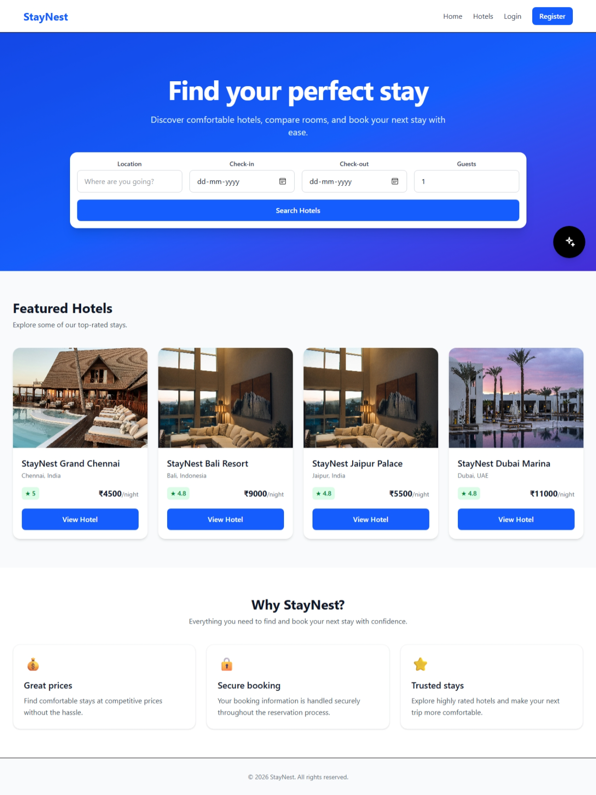
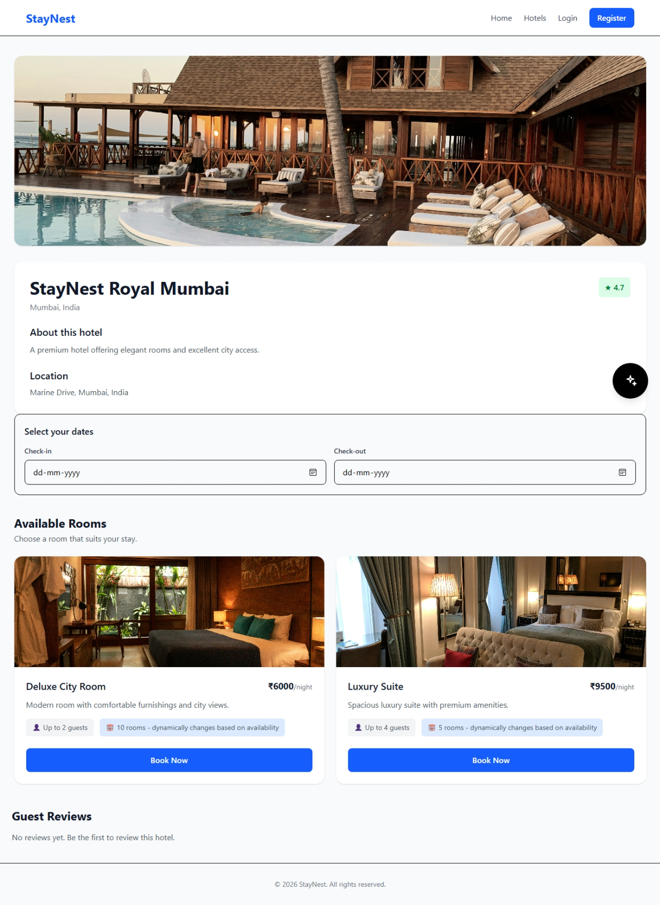
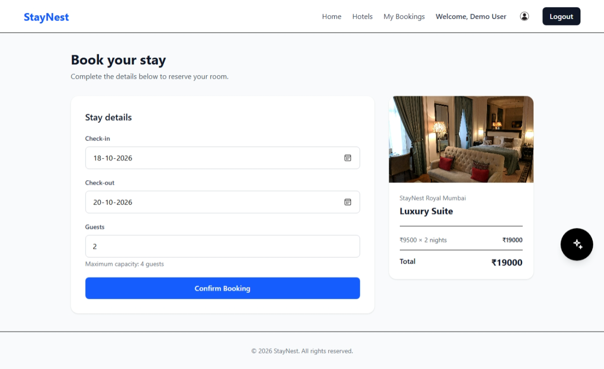
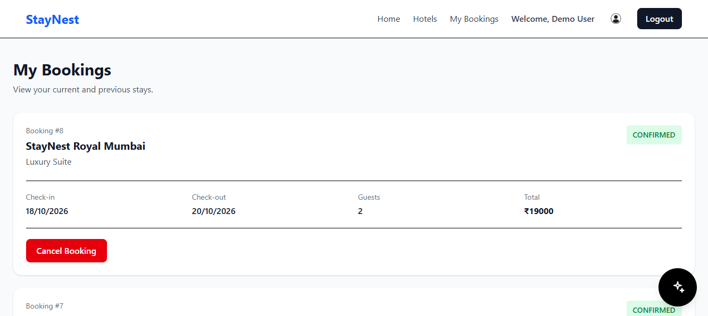
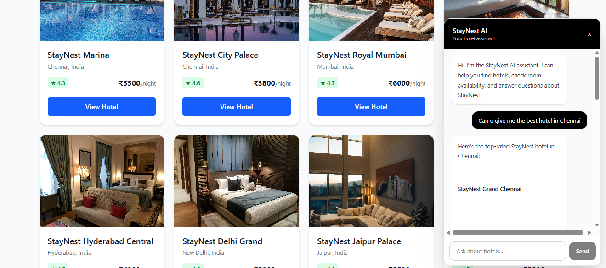
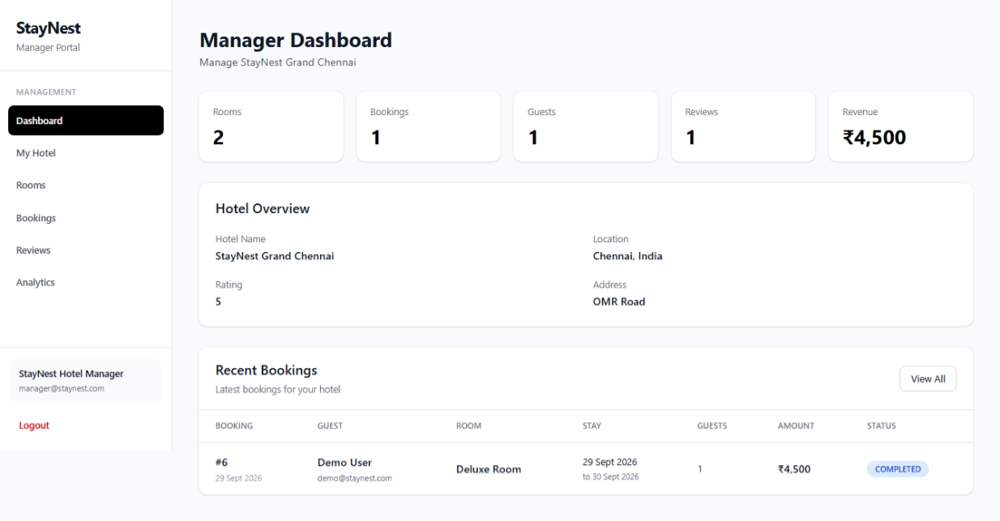
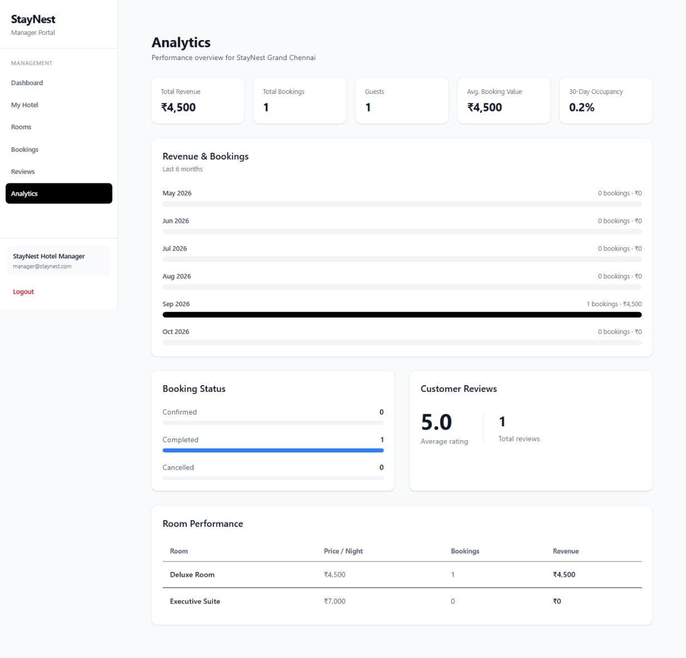

# StayNest — Full-Stack Hotel Booking Platform

StayNest is a full-stack hotel booking platform built as a capstone project.

It provides a complete hotel discovery and reservation experience with separate customer, hotel manager, and administrator workflows. The application includes hotel and room management, real-time room availability based on bookings, reservations, reviews, role-based access, and an AI-powered hotel assistant connected directly to the application's PostgreSQL database.

The project was built from the ground up using React, Node.js, Express, PostgreSQL, Prisma, and the Groq API.

---

## 📸 Project Preview

### Home Page


The home page provides hotel search, date selection, guest selection, and access to featured hotels.

---

### Hotel Details


Each hotel has a dedicated details page containing hotel information, available rooms, pricing, ratings, and reviews.

---

### Room Booking


Users can select a room, provide their stay details, and create a reservation.

---

### My Bookings


Users can view their reservations and manage eligible bookings, including cancellations.

---

### StayNest AI Assistant


The application includes an AI-powered hotel assistant capable of understanding natural-language hotel requests and retrieving real hotel data from the StayNest database.

---

### Hotel Manager Dashboard


Hotel managers have a dedicated dashboard for monitoring their hotel's rooms, bookings, guests, reviews, and revenue.

---

### Hotel Manager Analytics


Hotel Managers can see the performance of their Hotels and Rooms here.

---

## 🛠️ Tech Stack

### Frontend

- React
- Vite
- Tailwind CSS
- React Router
- React Markdown
- remark-gfm

### Backend

- Node.js
- Express.js
- REST API
- Native Fetch API
- CORS
- dotenv
- Nodemon

### Database

- PostgreSQL
- Prisma ORM
- pgAdmin

### AI

- Groq API
- `openai/gpt-oss-120b`
- AI Function / Tool Calling
- Database-grounded AI responses

### Authentication & Authorization

- Role-based access control
- Customer / Hotel Manager / Admin roles
- Protected backend routes

### Development Tools

- Git
- GitHub
- Visual Studio Code
- cURL
- Postman
- pgAdmin

## 🏗️ Architecture

```text
React + Vite + Tailwind CSS
            │
            ▼
        REST API
            │
            ▼
    Node.js + Express
       │          │
       ▼          ▼
    Prisma      Groq API
       │          │
       ▼          ▼
 PostgreSQL   GPT-OSS-120B
```

## 👥 User Roles

| **Customer** | Search hotels, view rooms, book and cancel bookings, review hotels, and use the AI assistant |
| **Hotel Manager** | Manage assigned hotel, rooms, bookings, reviews, and analytics |
| **Admin** | Platform-level administration and monitoring |

## 🗄️ Database Models

```text
User
Hotel
Room
Booking
Review
```

The relationships between these entities support hotel management, room inventory, reservations, reviews, and database-grounded AI data retrieval.

# ✨ Key Features

## Customer Features

- User registration and login
- Hotel discovery
- Hotel search and filtering
- Hotel details and room information
- Room pricing and capacity
- Date-based room availability
- Hotel reservations
- Booking history
- Booking cancellation
- Hotel ratings and reviews
- User profile
- AI-powered hotel assistant

---

## Hotel Manager Features

Hotel managers have their own dedicated management portal.

- Manager authentication
- Manager dashboard
- Hotel information management
- Room creation
- Room editing
- Room deletion
- Room inventory management
- Booking management
- Guest information
- Review management
- Revenue statistics
- Hotel performance analytics

Managers can only manage the hotel assigned to their account.

---

## Administrator Features

The administrator has a separate administrative interface for platform-level management.

- Administrator authentication
- Platform dashboard
- Hotel management
- User management
- Booking monitoring
- Platform statistics

---

# 🤖 AI-Powered Hotel Assistant

One of the main features of StayNest is the integrated AI hotel assistant.

The assistant uses the **Groq API** with the:

**`openai/gpt-oss-120b`**

model.

The AI does not invent hotel information. Instead, it can call backend tools that query the actual StayNest PostgreSQL database.

### AI Architecture

```text
User
 │
 ▼
React Chatbot UI
 │
 ▼
Express API
 │
 ▼
Groq API
 │
 ▼
AI decides which tool is required
 │
 ├── searchHotels
 │
 ├── getHotelDetails
 │
 ├── checkAvailability
 │
 └── searchAvailableRooms
 │
 ▼
Prisma ORM
 │
 ▼
PostgreSQL
 │
 ▼
Real StayNest Data
 │
 ▼
Groq
 │
 ▼
Natural-language response
```
